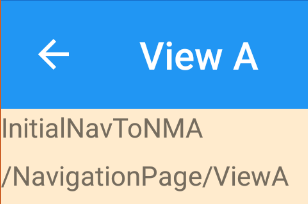
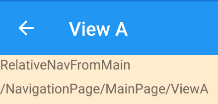

# **Update And Resolution**

Brian Lagunas has [resolved the bug report](https://github.com/PrismLibrary/Prism/issues/1800#issuecomment-495739316), saying:

> You shouldn't call that method in the OnNavAware methods because Xamarin hasn't finished processing. If you add a button to ViewA and then get the nav path on the button click it works just fine. Remember, navigation is async, and Prism is just calling a method when we programatically add a view to the XF nav stack. It doesn't mean that the nav process is finished until the "await" returns from the nav call.
ViewA now has a "Update Below" button that let's you see the GetNavigationUriPath result at the time of clicking the button, so now you can just click the button.

Everything in the README.md below this section is the original bug report.

# Steps To Reproduce Bug

## Launch App

Launch the app.  App.xaml.cs has navigated to "/NavigationPage/MainPage/ViewA?message=InitialNavToNMA".

You'll see the ViewA page.  The first line displays the value of the "message" nav param.  The second line displays the value of NavigationService.GetNaviguationUriPath().

The path is "/NavigationPage/MainPage/ViewA", but the wrong value "/NavigationPage/ViewA" is displayed.

## Go Back Once

Go back via the arrow icon or Android back button. You will arrive at MainPage, proving that MainPage really was on the nav stack; it's the GetNavigationUriPath that was wrong.

## Click "Nav To A" Button

Click the "Nav To A" button to do a relative nav to "ViewA?message=RelativeNavFromMain".

"/NavigationPage/MainPage/ViewA" is displayed, which is the correct path.

